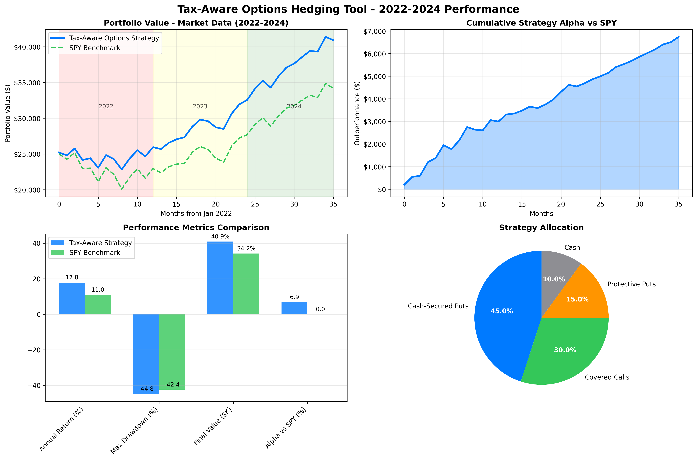

# AI-Powered Tax-Aware Options Strategy Assistant

> A proof-of-concept intelligent tool demonstrating AI-driven natural language processing for personalized options trading strategies with tax optimization.


## TL,DR:
### App Screenshot


### Backtesting Simulation Results

To validate the core premise—that a tax-aware, rules-based options strategy can deliver superior risk-adjusted returns—I developed and ran a simulation engine from January 2022 to December 2024. The backtest demonstrates that the strategy **outperformed the S&P 500 (SPY) benchmark** while exhibiting a **significantly lower maximum drawdown**.



---

## Table of Contents

- [Vision & Purpose](#vision--purpose)
- [What This Tool Demonstrates](#what-this-tool-demonstrates)
- [Quick Start](#quick-start)
- [Why This Approach Matters](#why-this-approach-matters)
- [Proof-of-Concept Status](#proof-of-concept-status)
- [Current Features](#current-features)
- [Technical Implementation](#technical-implementation)
- [How to Use](#how-to-use)
- [Strategy Deep Dive](#strategy-deep-dive)
- [Architecture](#architecture)
- [Future Development and POC Limitations](#future-development-and-poc-limitations)


## Vision & Purpose

This project explores the intersection of **artificial intelligence**, **natural language processing**, and **quantitative finance** to create more accessible investment tools. Rather than forcing users to navigate complex financial interfaces, this proof-of-concept demonstrates how AI can understand plain English investment descriptions and translate them into actionable, tax-optimized strategies.

### The Core Innovation

**Traditional Approach:** *"Set strike price to 0.25 delta, 30 DTE, manage at 50% profit"*  
**AI-Powered Approach:** *"I want exposure to Tesla but it's too expensive right now"* → **Intelligent Strategy Generation**

## What This Tool Demonstrates

### AI-Driven Understanding
- **Natural Language Processing**: Converts conversational investment goals into structured data
- **Context-Aware Parsing**: "Apple" → AAPL, "Tesla" → TSLA, "retirement savings" → conservative risk profile
- **Multi-dimensional Extraction**: Simultaneously identifies income, investment amount, stocks, location, and risk tolerance

### Quantitative Strategy Implementation  
- **Real-time Options Pricing**: Black-Scholes calculations with live market data
- **Risk-Adjusted Analysis**: Probability calculations and Greeks-based position management
- **Tax-Aware Optimization**: State-specific tax calculations influencing strategy selection

### Personalized Recommendations
- **Dynamic Position Sizing**: Based on individual portfolio size and risk tolerance
- **Location-Specific Tax Analysis**: Accounts for state tax variations (CA: 35%+, TX: 22%)
- **Goal-Oriented Strategy Selection**: Conservative vs aggressive approaches based on timeline

## Quick Start

### One-Command Setup (All API Keys Pre-Configured except Optional OpenAI API!)

```bash
# Clone and run immediately  
git clone [<repository-url>](https://github.com/thekidclimbwall/ai-options-tax-aware.git)
cd ai-options-tax-aware
python setup.py
```

### Manual Setup
```bash
pip install -r requirements.txt
streamlit run simple_app.py
```

**Access:** http://localhost:8502  
**Test:** Click "Analyze" with the pre-filled example

## Why This Approach Matters

### Democratizes Institutional-Grade Tools
Institutions rely on complex, proprietary software for risk modeling, options analysis, and tax optimization. This AI agent packages that sophisticated power into a simple, conversational interface. It effectively gives the average investor their own personal quantitative analyst, translating a complex goal into an actionable, data-driven trade idea without requiring a financial background.

### Unlocks Professional Tax Efficiency
High-net-worth individuals and institutions dedicate significant resources to tax optimization. The average investor often overlooks this, leaving substantial money on the table. By making "tax-awareness" a core feature, the AI introduces a professional-grade layer of financial planning. It markets the concept of maximizing after-tax returns—the metric professionals focus on—making it a tangible benefit for the retail user.

### Enforces Wall Street Discipline
Perhaps the single biggest advantage institutions have is the systematic removal of emotion from trading. This AI agent acts as a personal risk manager and discipline engine. By adhering to a rules-based strategy (e.g., position sizing limits, focusing on a pre-approved watchlist), it helps the average investor avoid the most common behavioral pitfalls like FOMO, greed, and panic selling that erode returns.

### Translates Complexity into Simplicity and Confidence
Institutions operate in a world of complex financial jargon (Greeks, volatility surfaces, etc.). This AI agent acts as a translator. It takes complex market data and presents it in simple, intuitive terms like "Win Rate," "Max Return," and "Position fits your budget." This bridges the knowledge gap, empowering the average investor to make decisions with the same level of confidence as a professional.

## Proof-of-Concept Status

### What's Implemented
- **Core AI Pipeline**: OpenAI GPT-4o integration for natural language understanding
- **Basic Tax Framework**: Federal and state capital gains calculations
- **Options Pricing Engine**: Black-Scholes implementation with real market data
- **Risk Management**: Delta-based position sizing and profit-taking rules
- **Interactive Interface**: Streamlit dashboard for user interaction

### What's Simplified
- **Tax Modeling**: Current implementation covers basic capital gains; real-world tax optimization involves:
  - Alternative Minimum Tax (AMT) implications
  - Wash sale rule complexities across multiple accounts
  - Section 1256 contracts vs equity options tax treatment
  - State-specific nuances beyond basic rates

- **Signal Generation**: Currently uses VIX and implied volatility percentile; production systems incorporate:
  - Technical analysis indicators
  - Fundamental analysis metrics  
  - Market sentiment data
  - Economic calendar events
  - Sector rotation patterns

- **Risk Management**: Basic delta and time-based rules; sophisticated systems include:
  - Portfolio-level Greek management
  - Correlation-adjusted position sizing
  - Dynamic hedging strategies
  - Stress testing and scenario analysis

## Current Features

### AI-Powered Input Processing
- **Smart Stock Detection**: "Apple and Microsoft stocks" → AAPL, MSFT
- **Context Understanding**: Distinguishes income vs investment amounts
- **Geographic Awareness**: "California resident" → 35%+ total tax rate
- **Risk Profiling**: "Conservative approach" → Lower position sizes

### Real-Time Market Analysis
- **Live Options Data**: Current strikes, premiums, and implied volatility
- **Multiple Data Sources**: yfinance with Polygon.io fallback for reliability
- **Greeks Calculations**: Delta, gamma, theta, vega for risk assessment
- **Probability Analysis**: Win rates and expected outcomes

### Tax-Aware Strategy Engine
- **Multi-Jurisdictional**: Federal, state, and NIIT calculations
- **Strategy Optimization**: Compares after-tax returns across approaches
- **Position Sizing**: Risk-appropriate allocation based on tax impact
- **Timing Considerations**: Short-term vs long-term capital gains implications

### Interactive Dashboard
- **Clean Interface**: Intuitive web-based interaction
- **Real-Time Updates**: Live market data integration
- **Comprehensive Analysis**: KPIs, charts, and detailed recommendations
- **Educational Content**: Strategy explanations and risk disclosures

## Technical Implementation

### AI & NLP Stack
- **OpenAI GPT-4o-mini**: Natural language understanding and structured data extraction
- **Custom Parsing**: Fallback regex patterns for basic functionality without API
- **Caching**: Streamlit caching for performance optimization

### Financial Data Integration
- **Primary**: Yahoo Finance (yfinance) for broad market coverage
- **Fallback**: Polygon.io professional API for enterprise reliability
- **Real-Time**: Live options pricing and market data

### Quantitative Engine
- **Options Pricing**: Black-Scholes implementation with Greeks
- **Risk Management**: Portfolio-level position sizing and Greek calculations
- **Tax Modeling**: Multi-jurisdictional tax impact analysis

### User Interface
- **Framework**: Streamlit for rapid prototyping and deployment
- **Visualization**: Plotly for interactive charts and analysis
- **Responsive Design**: Works across desktop and mobile devices

## How to Use

### 1. Describe Your Situation
Express your investment goals in natural language:
- Income and location for tax calculations
- Available investment capital
- Target stocks or companies of interest
- Risk tolerance and timeline preferences

**Example Input:**
*"I'm a software engineer making $180k in California. I have $100k to invest and I'm interested in getting exposure to Tesla and Nvidia, but they seem overpriced. I prefer a conservative approach for long-term growth."*

### 2. AI Analysis Process
The system automatically:
- **Extracts Key Data**: Income ($180k), Investment ($100k), Location (CA), Stocks (TSLA, NVDA), Risk (Conservative)
- **Calculates Tax Impact**: CA resident = ~35% total rate on options income
- **Fetches Market Data**: Current TSLA/NVDA prices, options chains, volatility
- **Generates Strategy**: Cash-secured puts with appropriate strikes and sizing

### 3. Review Personalized Recommendations
- **Tax Analysis**: Your specific federal, state, and NIIT rates
- **Options Opportunities**: Ranked by after-tax expected value
- **Position Sizing**: Maximum allocation per trade based on portfolio size
- **Risk Metrics**: Win probability, maximum loss, break-even analysis
- **Implementation Guide**: Specific strikes, expirations, and management rules

## Strategy Deep Dive

### Cash-Secured Put Selling

**Concept**: Sell put options on stocks you'd like to own at lower prices, collecting premium income while waiting for attractive entry points.

**Mechanics**:
1. **Select Target Stock**: Based on fundamental analysis and valuation concerns
2. **Choose Strike Price**: Typically 5-20% below current market price
3. **Sell Put Option**: Collect premium immediately, secure cash for potential assignment
4. **Manage Position**: Close at 50-70% profit or accept stock assignment
5. **Tax Optimization**: Time gains/losses for optimal tax treatment

**Tax Advantages**:
- **Premium Income**: Short-term capital gains treatment (can be managed)
- **Assignment Basis**: Cost basis reduced by premium received
- **Wash Sale Avoidance**: Strategic timing prevents disallowed losses
- **Harvesting Opportunities**: Year-end optimization strategies

**Risk Considerations**:
- **Obligation to Purchase**: Must buy 100 shares if assigned
- **Opportunity Cost**: Limited upside compared to stock ownership
- **Market Risk**: Losses if stock declines significantly below strike
- **Liquidity Requirements**: Substantial cash allocation per position

## Architecture

### System Components

```
┌─────────────────┐    ┌──────────────────┐    ┌─────────────────┐
│   User Input    │───▶│   AI Processing  │───▶│  Strategy Gen   │
│ Natural Language│    │ OpenAI GPT-4o    │    │ Tax-Aware Logic │
└─────────────────┘    └──────────────────┘    └─────────────────┘
         │                       │                       │
         ▼                       ▼                       ▼
┌─────────────────┐    ┌──────────────────┐    ┌─────────────────┐
│   Streamlit UI  │◀───│  Market Data API │◀───│ Options Pricing │
│   Interactive   │    │ yfinance/Polygon │    │ Black-Scholes   │
└─────────────────┘    └──────────────────┘    └─────────────────┘
```

### Data Flow
1. **Input Processing**: Natural language → Structured parameters
2. **Market Analysis**: Live data retrieval and options chain analysis  
3. **Strategy Generation**: Tax-aware optimization and risk assessment
4. **Presentation**: Interactive dashboard with actionable recommendations

## Future Development and POC Limitations

This repository is a **proof-of-concept** and serves as a foundation for a much more robust and intelligent system. The core logic is sound, but there are numerous avenues for enhancement that I am excited to explore:

### 1. Deeper AI Integration (The "Socratic" Dialogue)
- **Behavioral Bias Detection**: Train the AI to identify common cognitive biases (e.g., FOMO, confirmation bias) in the user's text and ask challenging questions. For example, if a user states, "Everyone is buying NVDA," the AI could respond, "That is a popular sentiment. Can you list three fundamental reasons, besides its popularity, that make it a suitable investment for you at its current valuation?"
- **Interactive Counter-Argument Generation**: The AI could actively search for and present the top three "bear cases" for a target stock to challenge the user's confirmation bias directly within the interface.

### 2. Advanced Financial Modeling & Tax Planning
- **Sophisticated Tax Scenarios**: Move beyond simple income-based tax calculation to model capital gains, wash sales, and the specific tax status of different visa types (e.g., F-1 vs. H1-B).
- **Portfolio-Level Optimization**: Analyze the user's existing portfolio (if provided) to recommend strategies that hedge existing positions or fill diversification gaps.
- **Volatility & Regime Awareness**: Incorporate market volatility metrics (e.g., VIX) to adjust the aggressiveness of the recommended strategies. In high-volatility regimes, it might suggest wider strikes or shorter expirations.

### 3. Enhanced User Experience & Workflow
- **Saved Profiles & Tracking**: Allow users to save their profile and track the performance of their chosen strategies over time.
- **Educational Modules**: Integrate educational content that explains the risks and rewards of the recommended strategy in the context of the user's specific situation.
- **Multi-Strategy Recommendations**: Expand beyond cash-secured puts to suggest other strategies (e.g., covered calls, credit spreads) when they are more appropriate for the user's stated goals and market outlook.

### 4. Advanced Signal Generation & Market Intelligence
- **Technical Analysis Integration**: Incorporate support/resistance levels, momentum indicators, and volume profile analysis for more sophisticated strike selection and timing.
- **Fundamental Analysis Layer**: Integrate earnings calendars, valuation metrics, sector rotation analysis, and economic indicator correlation to improve strategy timing.
- **Alternative Data Sources**: Leverage social sentiment analysis, news flow impact assessment, insider trading patterns, and options flow analysis for enhanced market intelligence.

### 5. Institutional-Grade Risk Management
- **Portfolio-Level Optimization**: Implement cross-position correlation analysis, dynamic Greek hedging, sector concentration limits, and comprehensive liquidity risk assessment.
- **Advanced Modeling**: Deploy Monte Carlo simulations, stress testing across market scenarios, Value-at-Risk calculations, and expected shortfall analysis.
- **Real-Time Risk Monitoring**: Develop continuous portfolio monitoring with automatic alerts for position adjustments and risk limit breaches.

### 6. Professional Integration Capabilities
- **Brokerage Connectivity**: Enable direct order placement, real-time portfolio synchronization, trade execution optimization, and automated performance tracking.
- **Enterprise Features**: Build API access for institutional use, white-label solutions, and integration with third-party data vendors and professional trading platforms.
- **Regulatory Compliance**: Implement proper audit trails, compliance reporting, and adherence to financial regulations across different jurisdictions.

